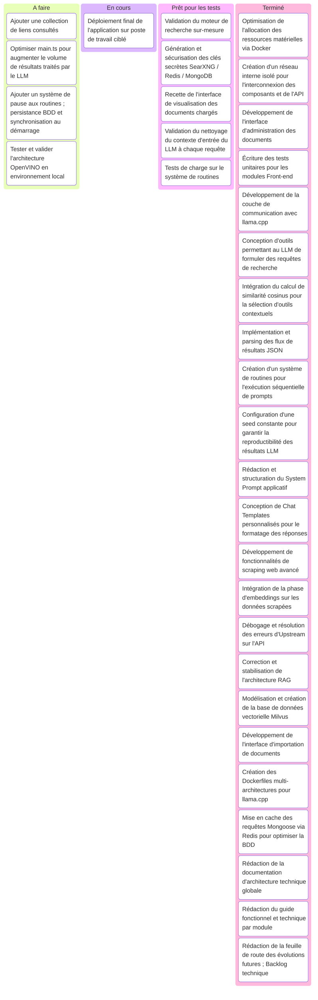

# Suivi de projet
Cette partie présente la méthodologie de gestion et de suivi de projet appliquée tout au long de mon stage.

Pour structurer les développements, l'ensemble du projet a été orchestré selon la méthodologie agile **Kanban**. Ce choix s'est avéré particulièrement adapté car il offrait une visibilité immédiate et transparente sur l'état d'avancement des tâches (flux de travail) à un instant T, facilitant ainsi la priorisation face aux défis techniques rencontrés.

### Suivi Kanban

Le tableau Kanban ci-dessus reflète l'organisation macroscopique planifiée au fil de l'avancement du projet.

Comme dans tout projet de recherche et développement (R&D), certaines fonctionnalités secondaires n'ont pas pu être totalement intégrées en production. Ce décalage s'explique principalement par la contrainte temporelle du stage, mais également par une sous-estimation initiale de la complexité liée à l'interconnexion des modèles de langage en local (gestion fine des caches, instabilité des prompts), m'imposant de prioriser la robustesse du cœur de l'application (le système RAG et la sécurité) au détriment de certaines options de confort.

### Bilan & Évaluation

La réalisation de ce stage a été une expérience particulièrement formatrice, me plongeant au carrefour du développement Full-Stack moderne et de l'intégration d'architectures d'Intelligence Artificielle (IA).

### Un double apport : Technique et Méthodologique
Sur le plan technique, j'ai pu consolider mes compétences fondamentales dans la conception d'application (architecture d'API REST, conteneurisation isolée, gestion d'états asynchrones) tout en montant en compétences sur des technologies de pointe. Concevoir une architecture RAG (Retrieval-Augmented Generation) complète en impliquant une base vectorielle proposé par Milvus, du caching haute performance obtenue par Redis, du scraping de données et l'optimisation locale d'un LLM sous llama.cpp, m'a permis de comprendre concrètement les problématiques d'infrastructure et de performances liées aux modèles d'IA.

Sur le plan méthodologique, l'utilisation de la méthode Kanban m'a appris à gérer un flux de travail de manière autonome, à chiffrer mes tâches avec plus de réalisme et à réagir de manière agile face aux imprévus techniques (tels que les problèmes d'Upstream de l'API ou les contraintes matérielles de Docker).

### Les livrables et perspectives pour l'entreprise
Bien que le backlog contienne encore quelques fonctionnalités dans la colonne À faire, les objectifs principaux du stage ont biens été atteints :

* L'application et fonctionnelle : L'entreprise dispose désormais d'un outil, sécurisé par un reverse proxy et entièrement configurable via Docker.

* Une optimisation technique : L'intégration de tests unitaires et d'un cache Redis garantit une base saine et évolutive pour de future ajouts.

* Une transition fluide : Grâce aux documentations rédigées (architecture, Swagger, évolutions), les prochains mainteneur disposes de toutes les informations clés nécessaires pour reprendre le projet, déployer l'architecture OpenVINO ou implémenter les fonctionnalités restantes sans friction.

Ce stage a ainsi pleinement validé ma capacité à traduire un besoin métier complexe et innovant en une solution logicielle concrète et documentée.