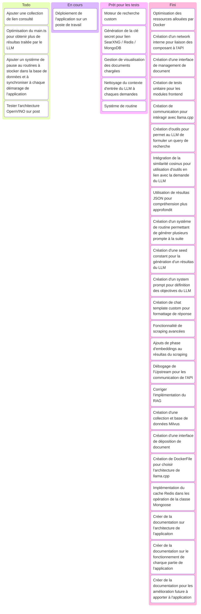

# Suivi de projet
Cette partie permet de présenter le suivi de projet de stage.
En effet l'ensemble du projet à été ordonnées par la méthode Kanban, car elle offrait une posibilité d'apercu immédiat de l'état d'avancement de tâches à un moment donnée.

### Suivi Kanban

Le suivi Kanban ci-dessus montre l'ensemble de l'organisation plannifier au fil de l'avancement du projet.
Certaine fonctionnalitée n'on pas pu être complètement intégrés, généralement à cause du manque de temps, mais aussi de la sous-estimation et 

### Bilan & Évaluation